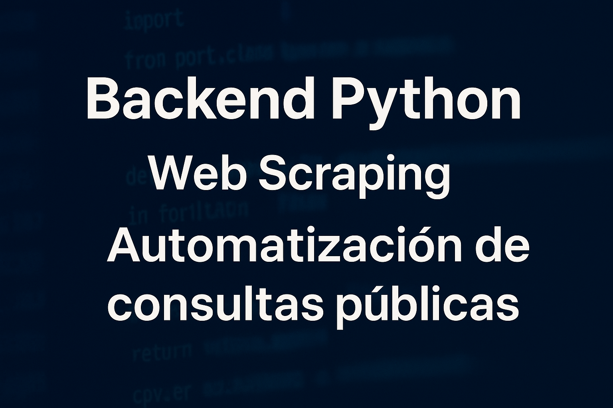

# Sistema de Scraping de Certificados

## 📘 Descripción General
Este sistema automatiza la **consulta, descarga, lectura y almacenamiento** del certificado.  

El proyecto está desarrollado en **Python**, y permite:
- Automatizar el llenado de formularios y descarga de certificados (vía **Selenium**).  
- Resolver captchas automáticamente (con **Tesseract OCR + OpenCV**).  
- Analizar y extraer información del certificado (con **pdfplumber**).  
- Guardar los resultados en formatos **SQLite** y **JSON**.  
- Ejecutar **pruebas automáticas y paralelas** con `unittest`.  
- Probar el flujo completo sin conexión (modo simulado).

---
## Instalación del Proyecto

Clonar o descargar el repositorio
git clone <link>

## 🧱 Estructura del Proyecto

```
project/
│
├── requirements.txt
├── identifier.sqlite
│
├── src/
│   ├── main.py
│   ├── scraping.py
│   ├── orc.py
│   ├── configuration.py
│   ├── storage.py
│   ├── pdf_parser.py
│   ├── create_pdf.py
│   └── utils.py
│
├── test/
│   ├── test_parallel.py
│   ├── test_pdf_extraccion.py
│   ├── test_storage.py
│   ├── test_suite.py
│   ├── test_integracion_flujo_completo.py
│   └── reports/
│
└── data/
    ├── pdfs/
    └── results/
```

---

## ⚙️ Instalación y Configuración

### 1️⃣ Requisitos previos
Asegúrate de tener instalados:
- **Python 3.10 o superior**  
- **Google Chrome**  
- **Tesseract OCR**

### 2️⃣ Instalar Tesseract OCR

#### 🔹 En Windows
1. Descarga desde:  
   👉 [https://github.com/UB-Mannheim/tesseract/wiki](https://github.com/UB-Mannheim/tesseract/wiki)
2. Durante la instalación, **habilita la opción "Add to PATH"**.  
3. Verifica que esté instalado correctamente:
   ```bash
   tesseract --version
   ```

El proyecto ya define en `orc.py` la ruta predeterminada:
```python
pytesseract.pytesseract.tesseract_cmd = r"C:\Program Files\Tesseract-OCR\tesseract.exe"
```
Si lo tienes en otra ubicación, actualiza esa línea.

---

### 3️⃣ Instalar dependencias del proyecto
Ejecuta en la raíz del proyecto:

```bash
pip install -r requirements.txt
```

---

## 🚀 Ejecución del Sistema

### 🔹 Modo Real (Scraping del portal oficial)

Este modo abre el navegador, llena los datos y descarga el certificado.

```bash (debe estar en la raiz del proyecto)
python -m src.main
```

📁 Resultados:
- PDF descargado en: `data/pdfs/session__.../`
- Información extraída guardada en:
  - `data/results/informacion.db`
  - `data/results/<timestamp>_<cedula>.json`

⚠️ **Requiere internet y acceso al sitio oficial.**

---

### 🔹 Modo Simulado (Pruebas locales)

Ejecuta todo el proceso sin conexión:  
Crea un PDF de prueba, lo analiza, extrae los datos y los guarda.

```bash
 python -m test.test_suite
 
 python -m test.test_parallel
```
Ambas generan reportes
En la carpeta `test/reports`


📁 Archivos generados:
- PDF falso: `data/pdfs/test_<fecha>.pdf`
- Resultado JSON + BD en `data/results/`

---

## 🧩 Componentes Principales

| Archivo | Descripción |
|----------|-------------|
| **main.py** | Controla el flujo principal de ejecución (scraping → PDF → almacenamiento). |
| **scraping.py** | Automatiza el navegador y maneja descargas. |
| **orc.py** | Resuelve el captcha usando OCR con Tesseract. |
| **pdf_parser.py** | Extrae información estructurada del PDF. |
| **create_pdf.py** | Genera PDFs de prueba para validaciones sin conexión. |
| **storage.py** | Guarda la información en SQLite y JSON. |
| **configuration.py** | Configura rutas, sesiones y creación del driver. |
| **utils.py** | Contiene constantes (URLs, IDs, XPaths, meses, etc.). |

---

## 🧠 Flujo General

1. Se abre una nueva sesión y carpeta de descarga.  
2. Se ingresa el número de cédula y la fecha de expedición.  
3. Se intenta resolver el captcha automáticamente (OCR).  
4. Se descarga el certificado PDF.  
5. Se lee y analiza el texto del PDF.  
6. Se guardan los resultados en JSON y SQLite.  
7. Se cierran los recursos del navegador.

---

## 🧪 Pruebas Automatizadas

El proyecto usa `unittest` e incluye pruebas:

| Prueba | Descripción |
|--------|--------------|
| `test_pdf_extraccion.py` | Valida lectura y parseo del PDF. |
| `test_storage.py` | Comprueba escritura en SQLite y JSON. |
| `test_integracion_flujo_completo.py` | Evalúa todo el flujo end-to-end. |
| `test_parallel.py` | Ejecuta casos de prueba simultáneos. |
| `test_suite.py` | Agrupa todos los tests en una suite. |

Ejecución:
```bash
python -m unittest discover -s test
```

---

## 🧾 Ejemplo de salida JSON

```json
{
  "cedula_ciudadania": "1.234.567.890",
  "nombre_ciudadano": "Juan Pérez",
  "fecha_expedida": "29-marzo-2011",
  "municipio_expedida": "Bogotá",
  "departamento_expedida": "Cundinamarca",
  "estado_cedula": "Vigente"
}
```

---

## 🧰 Dependencias Clave

- `selenium` – Automatización del navegador  
- `webdriver-manager` – Descarga y gestión del ChromeDriver  
- `pytesseract` – OCR para captchas  
- `opencv-python` – Limpieza y preprocesamiento del captcha  
- `pdfplumber` – Lectura y extracción de texto del PDF  
- `reportlab` – Generación de PDFs de prueba  
- `sqlite3` – Base de datos ligera embebida  
- `unittest` – Framework nativo de pruebas  

*(Todas listadas en `requirements.txt`)*

---

## ⚠️ Consideraciones Legales y Éticas
Este sistema fue creado **con fines académicos y de investigación técnica**.  
No debe usarse para automatizar consultas reales ni masivas al portal oficial.  

---

## 👨‍💻 Autor
**Versión:** 1.0.0  
**Lenguaje:** Python 3.10+  
**Fecha:** 2025  
